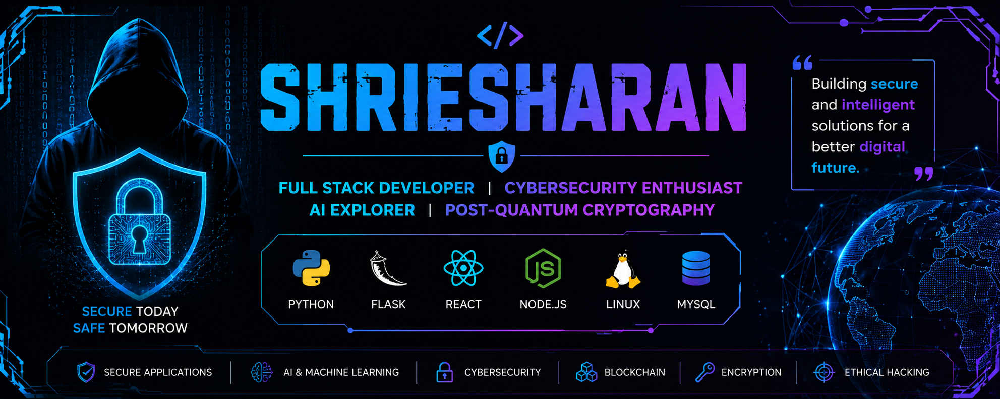

  

# Hi there 👋, I'm Shriesharan(CyberG0j0)

  

## 💻 Full Stack Web Developer | 🔒 Cybersecurity Enthusiast | 🤖 AI Explorer

I'm a Computer Science graduate passionate about building secure, scalable web applications and exploring modern cybersecurity technologies. I enjoy creating projects that combine software development with AI and cryptography.

---

## 🚀 About Me

- 🎓 B.Sc. Computer Science with Data Analytics
- 💻 Full Stack Web Developer
- 🔒 Interested in Cybersecurity & Ethical Hacking
- 🤖 Exploring AI for Security
- 🔐 Learning Post-Quantum Cryptography
- 🌱 Always learning new technologies

  ---
## 📊 GitHub Stats

  
  

  ---
## 🔥 Contribution Streak

  

---

## 🛠️ Tech Stack
## 💻 Tech Stack

## 🌟 Featured Projects

### 🔐 PQChat
A Post-Quantum Secure Chat Application implementing:
- ML-KEM-768 Key Exchange
- ML-DSA-65 Digital Signatures
- AES-256-GCM Encryption
- Secure Authentication
- Modern Chat Interface

---

### 🤖 AI Interview Preparation Portal

An AI-powered platform featuring:
- Mock Interviews
- Coding Challenges
- HR Questions
- AI Feedback
- Progress Tracking

---

## 📚 Currently Learning

- Advanced Web Security
- Penetration Testing
- Cloud Security
- Secure Software Development
- AI Security

---

## 📫 Connect With Me

- GitHub: https://github.com/CyberG0j0
- LinkedIn: *(Add your LinkedIn profile here)*
- Email: *(Add your professional email here)*

---

⭐ Thanks for visiting my profile!
